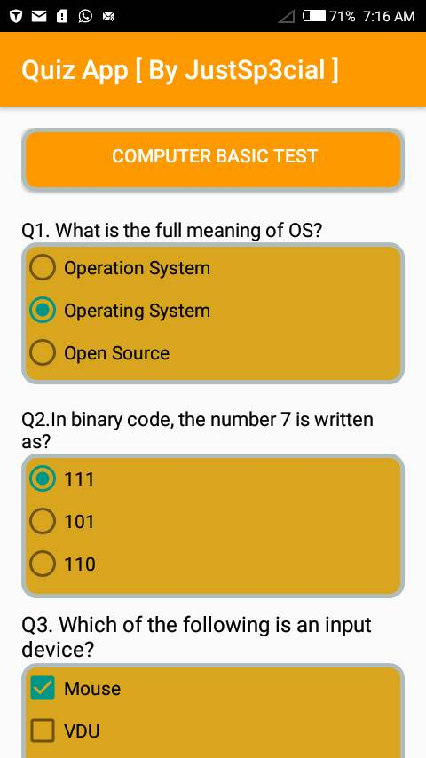
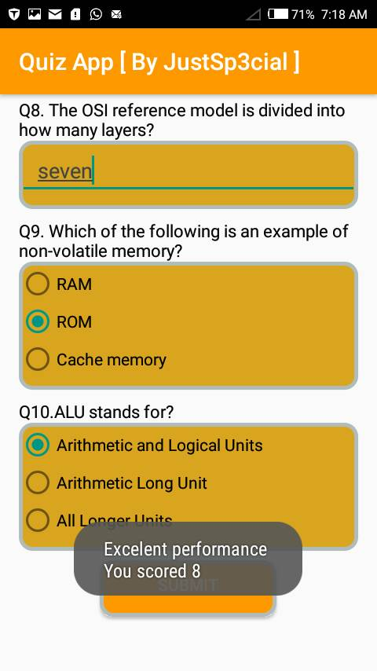

# QuizApp
This is an Android application that quizzes a user about general Computer Basic Knowledge.
The application make use of radio buttons to select only one option at a time. 
Checkboxes to select more than one option at a time and textfield that allow user to enter answer via the keyboard.
The application has three categories of performance base on user's score which are poor, good and excelent
The application aslo display the user score.

## [App APK Download Link](https://drive.google.com/open?id=1EAownL6Rkt_E_Ws0CmycgiBY6IHCzkMU)

## Screenshots
<table>
    <tr>
        <td>
            
        </td>
        <td>
            
        </td>
    </tr>
</table>

## Tags
#7DaysofCodeChallenge #Udacity #GoogleScholarship #ALC3.0
